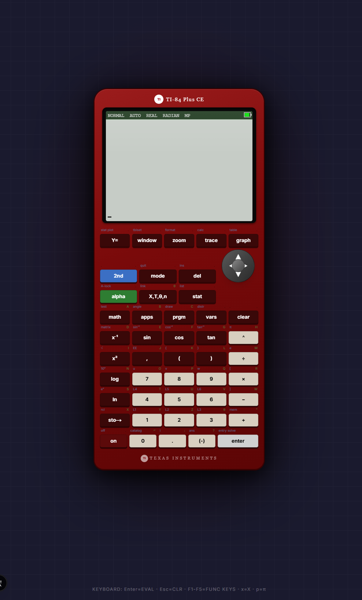

# TI-84 Plus CE High-Fidelity Web Simulator



A meticulously engineered, pixel-perfect, and exceptionally advanced web-based emulator for the **TI-84 Plus CE** graphing calculator. Built strictly with modern web infrastructure (Next.js 14, Tailwind CSS, Zustand, and Prisma), this emulator pushes the boundaries of React state mechanics, Canvas coordinate mapping, and calculus computation algorithms directly in the browser.

---

## 🚀 Features & Capabilities

This simulator is not a static webpage. It executes a full-fledged abstract syntax engine to natively compile algorithms, matrix calculations, boolean logic, and programmatic loops identically to original physical mathematical hardware.

### 1. Unified Mathematical Engine
- **Algebra operations**: Fractions, associative logic `()`, exponentiation, square roots, log/ln, and scientific E notation.
- **Trigonometry Engine**: Cross-compliant `sin`, `cos`, `tan` calculations properly switching formats based on `RADIAN`, `DEGREE`, or `GRADIAN` toggles.
- **Complex Number Formats**: Generates native responses under `$a+bi$`, `REAL`, or Polar (`$r e^{\theta i}$`) architectures natively.

### 2. Multi-Paradigm Graphing Engine
The HTML5 `<Canvas>` dynamically binds to screen overlays drawing High-DPI mathematical plotting:
- **Function Drawing (`FUNC`)**: Tracks `Y1 =` through `Y0 =` executing curve plots dynamically across custom X/Y `[WINDOW]` parameters.
- **Parametric Tracing (`PAR`)**: Graphs arrays calculating dual conditions `X1T=` & `Y1T=` over independent `T` time constraints.
- **Polar Coordinates (`POL`)**: Handles rendering equations such as $r = \sin(\theta)$ using radial sweeping bounds.
- **Trace Pointer Tracking**: Calculates intersection coordinates tracking directly on graph boundaries.

### 3. Calculus / Stats Distributions (DISTR)
Fully injected Math.js logic to approximate statistical density formulas on command:
- `normalcdf(lower, upper, μ, σ)`
- `normalpdf(x, μ, σ)`
- `invNorm(area, μ, σ)` (Accurate precision root resolving Z-scores)
- `binompdf(n, p, x)`

### 4. Advanced Applications (APPS)
- **Time-Value-of-Money (TVM) Solver**: A specialized dedicated application overlay identical to physical calculators.
- Maps internal variables: `N`, `I%`, `PV`, `PMT`, `FV`, `P/Y`, `C/Y`.
- Fires internal Newton-Raphson approximation to automatically backwards-evaluate unprovided roots (e.g., hitting `ALPHA + SOLVE` to define Missing Payments or Present Value).

### 5. Multi-Dimensional Matrices
- Store and build matrices named `[A]` through `[J]` in the `MATRIX` overlay.
- Execute calculations natively on the home screen testing `[A] + [B]`, obtaining dimension states (`dim([A])`), determinants (`det()`), or inverses `[A]^-1`.

### 6. Logic Overlays (TESTMenu) 
- Inequality mappings: `<`, `<=`, `>`, `>=`, `=`, `≠`.
- Boolean bitwise operations natively parsing binary truths: `and`, `or`, `xor`, `not()`.

### 7. Internal TI-BASIC Compilation
- Built-in `PRGM` App allowing the storage and running of TI-BASIC syntax code!
- Complete control loop recognition executing `For(`, `While(`, `If`, `Then`, `Else`, `End`.
- Supports IO bindings natively triggering `Input` and `Disp` lines into the simulator’s visual output loop.

### 8. Premium UI / UX Integrity
- **Authentic Visual Renderings**: Accurate CSS-driven aesthetics including the high-gloss screen layer, standard key layouts with Alpha/Second legends, and directional D-Pads.
- **Context-Aware Mouse Input Focus**: Actively locks interactions so cursor inputs never lose focus. Tapping an on-screen Calculator key manually maps `SyntheticEvents` back into editable React DOM blocks regardless of physical clicking events.

---

## 🛠 Tech Stack

| Domain | Technology | Use Case |
|--------|---------|-------------|
| **Core Framework** | Next.js 14 (App Router) | Structural hierarchy and SSR. |
| **Logic Engine** | Math.JS | Parsing advanced arithmetic configurations. |
| **State Tree** | Zustand | Universal tracking across 30+ Mode/Screen states. |
| **Styling** | Tailwind CSS V4 | Rapid flex mapping mapping TI hardware bezel dimensions. |
| **Rendering** | HTML5 Canvas | High-DPI graphing and UI screen tracing. |
| **Persistence** | Prisma + PostgreSQL | Automated DB checkpoints saving history variables across browser refreshes natively via Vercel logic. |

---

## 🕹 Usage & Installation

### Local deployment

```bash
# Clone the repository
git clone https://github.com/your-username/ti-84-emulator.git
cd ti-84-emulator

# Download vital node-modules
npm install

# Run the live development server!
npm run dev
```

Visit the application at `http://localhost:3000`. 

### Keyboard Shortcuts
For lightning-fast workflow testing, you don't even have to click!
- Type characters seamlessly mappings automatically onto the home screen inputs.
- `F1 - F5` Maps exactly to the physical top bar (`Y=`, `WINDOW`, `ZOOM`, `TRACE`, `GRAPH`).
- `X` or `x` immediately drops the universally dynamic variables `X/T/θ/n`!
- Pressing `ALT + ENTER` evaluates advanced `ALPHA + SOLVE` integrations inside the Apps screen natively!

---

*This application was engineered focusing on architectural parity matching mathematical limits. Happy calculating!*
